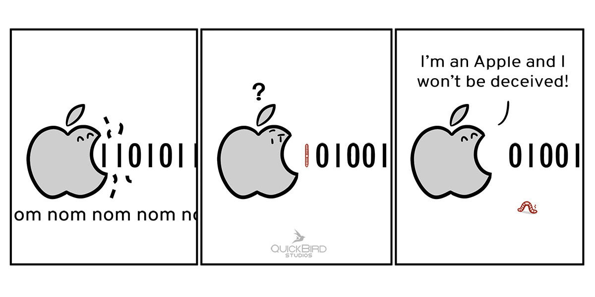

# Data Integrity: CRC with Swift on iOS

 

This repository contains the implementation of 8, 16 and 32 bit CRCs (CRC-8, CRC-16 and CRC-32). The implementation uses the *Big Endian* format for input and polynomial.

If you want to understand how the CRC works in more detail, please check our article on [How to Validate Your Data with a Cyclic Redundancy Check (CRC)](https://quickbirdstudios.com/blog/validate-data-with-crc/).

If you want to read more about how these implementations works, please check our article on [Data Integrity: CRC with Swift on iOS](https://quickbirdstudios.com/blog/data-integrity-crc-swift-ios/).
