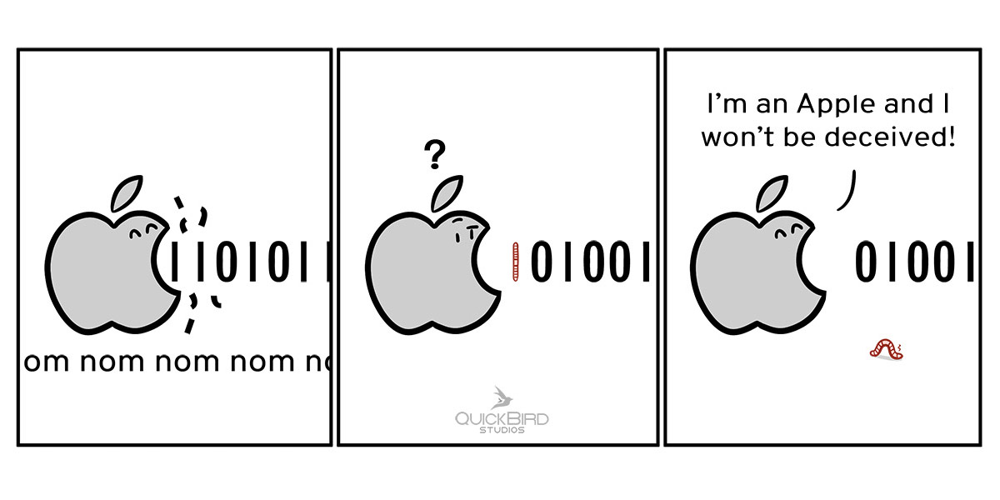

# CRC



A small, dependency-free Swift package for computing CRC-8, CRC-16, CRC-32, and CRC-64 checksums. Ships with all the standard named variants (Modbus, X.25, CCITT, ECMA, ISO, …), a streaming `CRCCalculator`, and a throwing `verify(_:for:)` API for data-integrity checks.

[](https://swift.org/package-manager/)
[](https://swift.org)
[](LICENSE)

## Features

- CRC-8, CRC-16, CRC-32, and CRC-64, all backed by a single generic `CRC<Value: FixedWidthInteger>` type.
- Configurable `polynomial`, `initialValue`, `xorOut`, and `reflected` bit order. The same algorithm covers both the classic big-endian convention and reflected ("little-endian") variants via `reflected: true`.
- Pre-built standard variants as static factories: `CRC16.modbus`, `CRC16.ccitt_false`, `CRC32.default`, `CRC32.bzip2`, `CRC64.ecma`, `CRC64.iso`, and many more.
- One-shot computation via `calculate(for:)` or incremental/streaming computation via `CRCCalculator`.
- `Checksum` protocol with a throwing `verify(_:for:)` that raises `VerificationError` on mismatch.
- Pre-computed 256-entry lookup table generated once per `CRC` instance.
- No dependencies, not even `Foundation`.
- Swift 6 ready — builds under strict concurrency, and `Checksum`, `CRC`, `CRCCalculator`, and `VerificationError` are all `Sendable`.

## Installation

### Xcode

**File ▸ Add Package Dependencies…** and enter:

```
https://github.com/QuickBirdEng/crc-swift
```

### Package.swift

```swift
dependencies: [
    .package(url: "https://github.com/QuickBirdEng/crc-swift", from: "1.0.0"),
],
targets: [
    .target(name: "MyApp", dependencies: [
        .product(name: "CRC", package: "crc-swift"),
    ]),
]
```

## Quick start

```swift
import CRC

let bytes: [UInt8] = Array("123456789".utf8)

// Use a named variant…
let modbus = CRC16.modbus.calculate(for: bytes)   // 0x4B37

// …or build your own.
let custom = CRC16(polynomial: 0x1021, initialValue: 0xFFFF, reflected: false)
let checksum = custom.calculate(for: bytes)
```

`calculate(for:)` accepts any `Sequence<UInt8>`, so `Array<UInt8>`, `Data`, `ArraySlice<UInt8>`, etc. all work directly.

## Streaming / incremental

When the payload arrives in chunks, use `CRCCalculator` (also available as `CRC8Calculator`, `CRC16Calculator`, `CRC32Calculator`, `CRC64Calculator`):

```swift
import CRC

var calculator = CRC32Calculator(.default)
calculator.append([0x01, 0x02])
calculator.append([0x03, 0x04])

// Convenience overloads for multi-byte values (always serialized big-endian):
calculator.append(bigEndian: UInt32(42))
calculator.append(bigEndian: Float32(3.14))

let crc = calculator.finalValue

// Reuse without re-allocating the lookup table:
calculator.reset()                          // same CRC config
calculator.reset(switchingTo: .bzip2)       // swap to a different variant
```

## Verification

Both `CRC` (via the `Checksum` protocol) and `CRCCalculator` can verify against an expected value and throw `VerificationError` on mismatch:

```swift
import CRC

let payload: [UInt8] = Array("123456789".utf8)

do {
    try CRC16.modbus.verify(0x4B37, for: payload)   // succeeds
    try CRC16.modbus.verify(0x0000, for: payload)   // throws
} catch let error as VerificationError<UInt16> {
    print("CRC mismatch — expected 0x\(String(error.expectedValue, radix: 16)), got 0x\(String(error.actualValue, radix: 16))")
}
```

## Standard variants

A non-exhaustive list — see [`Sources/CRC8.swift`](Sources/CRC8.swift), [`CRC16.swift`](Sources/CRC16.swift), [`CRC32.swift`](Sources/CRC32.swift), and [`CRC64.swift`](Sources/CRC64.swift) for the full set.

| Width  | Examples                                                                                       |
| ------ | ---------------------------------------------------------------------------------------------- |
| CRC-8  | `.default`, `.cdma2000`, `.darc`, `.dvbS2`, `.ebu`, `.itu`, `.maxim`, `.rohc`, `.wcdma`        |
| CRC-16 | `.modbus`, `.ccitt_false`, `.kermit`, `.xmodem`, `.usb`, `.x25`, `.arc`, `.maxim`, `.genibus`  |
| CRC-32 | `.default` (IEEE 802.3), `.bzip2`, `.c` (Castagnoli), `.mpeg2`, `.posix`, `.jamCRC`            |
| CRC-64 | `.ecma`, `.iso`                                                                                |

If your variant isn't listed, construct one directly:

```swift
let crc = CRC32(polynomial: 0x04C11DB7,
                initialValue: 0xFFFFFFFF,
                reflected: true,
                xorOut: 0xFFFFFFFF)
```

## A note on bit order

CRC variants disagree on whether bytes are fed MSB-first ("big-endian", the textbook form) or LSB-first ("reflected"). This library uses the big-endian convention by default and switches to the reflected algorithm when you pass `reflected: true` — or use a named variant that already does. The polynomial is always specified in its non-reflected form.

## Requirements

- Swift 6.0 or newer
- macOS 11+, iOS 14+, tvOS 14+, watchOS 7+, or Linux

The only platform-gated code is an optional `Float16` overload on `CRCCalculator.append(bigEndian:)`, available on arm64 Apple platforms.

## Further reading

- [How to Validate Your Data with a Cyclic Redundancy Check (CRC)](https://quickbirdstudios.com/blog/validate-data-with-crc/)
- [Data Integrity: CRC with Swift on iOS](https://quickbirdstudios.com/blog/data-integrity-crc-swift-ios/)

## License

CRC is released under the MIT license. See [LICENSE](LICENSE).
